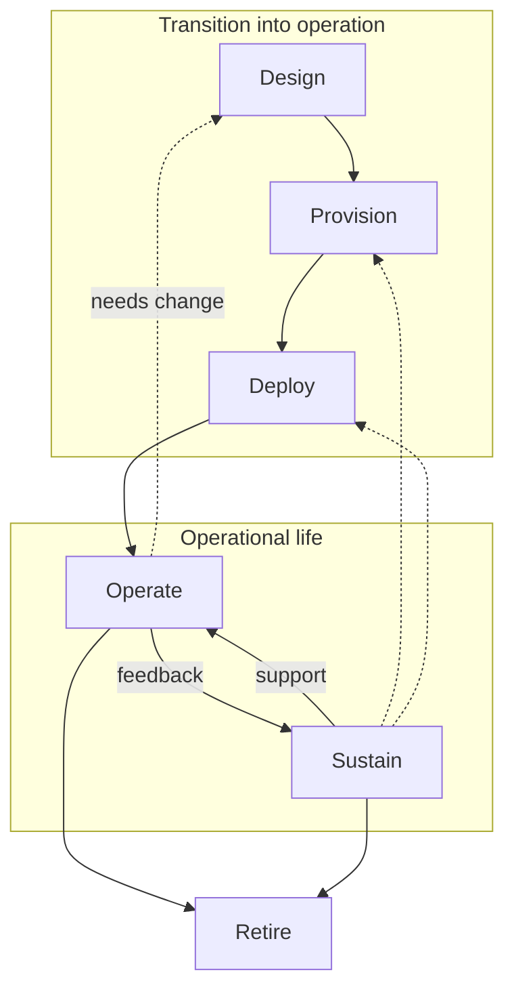

# Business Mission Analysis

## Executive summary

B2B software organisations often begin tailoring software services for individual customers with shared repositories, specialist knowledge and platform-specific automation.
As the number and variety of solutions in the portfolio grow, that mix becomes a constraint.
Responsibility blurs across teams, intended software becomes difficult to relate to what is running, and a change for one customer can affect another.
Routine delivery then depends on development specialists who should be improving reusable capabilities, not bridging the same gaps repeatedly.

This project is building an opinionated, open-source Go toolkit for B2B software organisations that tailor software services for individual customers and need to manage a growing solution portfolio without proportional growth in specialist intervention.
It is more than a Go library: it establishes a common way for an adopting organisation to express each solution's design and manage the corresponding solution through design and transition into running services while preserving its identity and intent throughout its lifecycle.
Its Go packages, semantic contract, supported extension mechanisms and reference tools allow incremental adoption alongside local tooling and platforms.

The intended change is organisational as much as technical.
It makes solution design explicit across responsibilities.
Inspectable and reproducible transition and deployment know-how explains how the adopting organisation puts that solution into operation in a particular setting.
Keeping the design and that know-how explicit allows different specialists, tools and locations to participate without losing the solution's identity, intent, history or line of accountability.

The current prototype is an early increment, not the final scope of the toolkit.
Its first useful proof is narrow: replace part of an incumbent delivery process and produce an observable running service whose footprint is acceptable against criteria agreed in advance.
Evidence of broader value requires a complete customer thread, repetition within an adopting organisation, and eventually results across materially different adopting organisations.

## Business context

The motivating case is a brownfield software business delivering tailored solutions across development, staging, production and laboratory environments.
Its estate spans cloud and local infrastructure.
Some backing services belong to one solution.
Others are shared services from which each solution receives an account, database or other slice.
Provisioning crosses declarative systems, operational platforms and manual actions.
Several application versions must coexist because customers do not all move together.

The delivery system grew around those realities without retaining clear boundaries.
A shared environment repository allowed a change for one solution to affect another and contributed to a cross-solution failure.
Layers of configuration obscured which applications and versions belonged to each solution, and whether the running service still matched its design.
Knowledge of how to prepare a platform, obtain a shared-service slice and connect it to an application lived in bespoke tooling and specialists' memories.

Recurring customer delivery work therefore required specialists to supply expertise, access or authority personally, or to change reusable application or platform capability.
The issue was the dependency, not which department performed the work.
That dependence limited growth and drew specialists away from improving capabilities shared by many solutions.

GitOps and automation are present in this story, but neither is the root problem.
Automation can repeat a poorly bounded process, and a repository can version files without making the identity and history of each solution clear.
The underlying failures are blurred responsibility, weak version and provenance traceability, cross-solution blast radius, tacit transition know-how and routine dependence on specialists to connect the pieces.

This case does not prove that every organisation has the same estate or severity of problem.
It does expose a broader risk: local practices accumulate faster than the business develops a durable way to say what each customer solution is, how it should be realised and who is accountable for the work.

## Mission and opportunity

The mission is to establish a durable identity-and-intent handoff for each logical solution.
A logical solution is the durable identity-bearing whole intended to satisfy the needs of its business beneficiary.
It is one living business and operational subject with its own identity, lifecycle, history and accountability, not a disposable template or incidental collection of deployment files.

A **solution design** expresses which software is chosen for a logical solution, how it is configured and the relationships among its parts.
It is semantic content, not an artefact.
The adopting organisation uses those semantics to make the solution's intent explicit.
Participants in the durable handoff exchange the solution's identity and a representation of its design together with inspectable and reproducible know-how for transition into operation.
That know-how covers how backing capabilities are prepared or attached, target-specific forms are derived and intended applications become running services.
The toolkit's semantic contract standardises the identity and design meanings that participants must preserve across environments, while the adopting organisation's process keeps target-specific procedures explicit in its tooling.

The business objective is to grow routine tailored delivery without proportional growth in specialist intervention.
Here, specialist intervention is delivery-specific work that the established delivery path cannot complete without specialist-held expertise, authority or access, or a change to reusable software or platform capability.
For example, only developers may hold the authority required to create or approve a customer-specific GitOps commit, and only they may hold the relevant CLI credentials used by provisioning commands.
An agent executing the work does not remove the dependency when the specialist must still supply the knowledge, authority or access.
Routine tailoring, provisioning and deployment use established capabilities and procedures with appropriately delegated access and authority.
The nature of the work, not the person's title, determines whether it is specialist intervention.
Extending a reusable application for one delivery is software development.
Running an established provisioning procedure through the established delivery path with appropriately delegated access and authority is routine delivery.
It remains specialist intervention when completion still depends on specialist-held expertise, authority or access.
Changing the procedure is platform development.

The handoff makes the change boundary visible.
Teams can see which solution a change belongs to and relate the application and version observed in operation to those specified in the solution design.
It also reveals capability gaps.
When a delivery needs new reusable software or new platform behaviour, the adopting organisation can plan that improvement explicitly instead of concealing it within customer fulfilment.

## System boundary and operating model

The toolkit is the system of interest within an adopting organisation's wider sociotechnical delivery system.
In this document, an **adopting organisation** is a B2B, software-centric organisation that incorporates the toolkit into the people, policies, tools and platforms through which it delivers tailored solutions.
The adopting organisation and its customer are distinct.
The adopting organisation owns the delivery system.
The customer receives and uses the operational solution to achieve a business outcome.

The boundary separates four related things.
The toolkit supplies a semantic contract, Go packages, supported extension mechanisms and reference tooling.
The logical solution is the identity-bearing subject.
The contract preserves the logical solution's identity and design meanings across its lifecycle.
The platform is an operational capability owned by the adopting organisation on which solutions run.
The customer outcome arises when the customer uses the operational solution.
The toolkit can contribute to that outcome, but producing an artefact neither transfers platform ownership nor guarantees business results.

The operating model divides delivery work into three enduring responsibility domains:

| Responsibility domain | Primary concern | Enduring accountability |
| --- | --- | --- |
| **Solution engineering** | Solution design | Understand beneficiary needs, curate the solution design, and validate that the operational solution fulfils those needs. |
| **Software engineering** | Reusable application catalogue | Develop and verify the reusable software capabilities from which solutions are composed, including their supported means of configuration and integration. |
| **Platform/service engineering** | Ready platform estate and backing-service catalogue | Make platforms and backing services ready to receive solution work, and provide the means specific to the adopting organisation to provision, deploy and sustain solutions there. |

These are domains of responsibility, not prescribed teams.
One person, team or automated actor may wear several hats.
Full mission fulfilment still requires the accountabilities to remain distinguishable, so that routine delivery is not mistaken for software development and changes to platform automation are not hidden inside ordinary deployment.

Customer use and organisational sustainment are also distinct.
The customer uses the operational solution.
The adopting organisation sustains it through monitoring, support, repair and change, and capacity planning.
Both may involve all three domains, but neither creates a fourth responsibility domain.

A platform is ready when it can accept provision or deploy work.
It need not be empty or new.
A brownfield platform may already run solutions and shared services.
The adopting organisation retains infrastructure ownership and responsibility for authorising and executing operational changes, reconciliation and deployment acceptance, even when it uses toolkit-supplied code.

## The durable handoff and the life of a solution

A logical solution has a durable identity.
Two solutions remain distinct even when their present contents match, and a solution retains that identity as its contents change.
The identity carries the solution's lineage, lifecycle, history and accountability through those changes.
This is the unit of **operational isolation** in the mission: each solution can be changed, placed and retired on its own terms.
The term does not promise security, compute, network, data, resource or failure isolation.

A **business beneficiary** is a business entity whose needs justify a logical solution and against whose needs that solution is designed and validated.
A beneficiary may be associated with several logical solutions, and its footprint may be attributed or billed across them.
A customer, tenant, user or subscriber does not become a beneficiary merely by consuming the operational service.
A multi-tenant solution may have the adopting organisation as its beneficiary while serving a changing customer population.
Several customers are beneficiaries only when their collective needs justify the solution; multi-tenancy alone does not establish that relationship.
The beneficiary relationship does not by itself grant lifecycle or deployment acceptance authority.
It is a semantic business relationship, not a prescribed artefact field.

A **Location** is an opaque identity defined by the adopting organisation for a place where all or part of a solution may be available.
It may denote a site, cluster, namespace, machine, region or something else.
A logical solution may be realised through cooperating parts placed at multiple Locations.
Partitioning that realisation across Locations does not by itself create additional logical solutions.
An adopting organisation may constrain each logical solution to one Location, but that is its policy rather than a universal semantic rule.
A completed relocation is different from continuing concurrent placement: operation ends at the old placement and the same solution identity continues at the new Location.
Ending the old placement is not retirement.
How blue/green delivery, warm standby, disaster recovery, overlapping relocation and other concurrent-placement patterns affect design and lifecycle remains unresolved until later operational work supplies better evidence.
Those patterns do not by themselves determine logical-solution cardinality.

Participants use artefacts at the handoff without equating the solution with a file.
A **solution artefact** is the identity-bearing umbrella for material exchanged about a solution.
The Solution Exchange Format, or SEF, is the project's serialised exchange format and one kind of solution artefact.
The **intermediate representation**, or IR, is a low-level actionable description of the intended deployment footprint, understandable without solution identity.
IR is not the lifecycle record.
Artefact schemas, containment, carriers, custody, partitioning and cardinality remain open.

**Semantic portability** applies to meaning, not implementation.
A solution's identity and design meaning must remain the same after crossing a handoff or moving to a materially different target.
Local tools may represent and act on that meaning differently.
The toolkit does not promise byte-for-byte artefacts, a portable record of every transformation or equivalent operational behaviour.

Relevant software provenance is narrower.
It identifies the reusable application and version specified in the solution design, and the application and version observed in operation.
Traceability connects those two points; it need not reconstruct every transformation between them.

The solution's activities have a direction: their purpose is to put a solution into customer use and keep it useful:

- **Design** brings the logical solution into being by establishing its identity and creating its initial solution design.
  Later **Design** work may revise that design without changing the solution's identity.
- **Provision** renders the required backing capabilities usable by the solution.
- **Deploy** renders the intended applications operational.
- **Operate** is the customer's use of the solution to meet its needs.
  The resulting experience and outcomes reveal whether the solution continues to satisfy those needs.
- **Sustain** is the adopting organisation's work to keep the operational solution fit for use.
  It includes routine monitoring and maintenance, operational support and repair, and capacity planning.
- **Retire** is terminal.
  It ends the solution's operational life, while its identity and history remain retained and are not reassigned.

The dotted return arrows distinguish two reasons to repeat work:

- New or changed beneficiary needs return the solution to **Design**.
  Evidence during **Operate** that the solution no longer satisfies those needs also returns it to **Design**.
  The solution design may change, but the solution retains its identity.
- Operational needs identified during **Sustain** may return the solution to **Provision** to restore, replace or scale backing capabilities, or to **Deploy** to restore the intended applications to operation.
  This work leaves the solution design unchanged, provided that the design still reflects beneficiary needs.

When an activity's result changes, downstream results must be reassessed; an unaffected result may be reaffirmed without repeating the activity that produced it.
Detailed triggers, retries, concurrency and recovery belong to the later operational concept and architecture.

## Product posture and adoption

The product is an opinionated open-source Go toolkit, not a mandate for one delivery platform.
It offers a common contract, supported extension points and coherent reference tools.
Adopting organisations can compose its packages with local code and replace a reference tool where another implementation preserves the required semantics.
Semantic compatibility at a handoff means that two participants preserve the meaning required there.
It does not make their tools or artefacts interchangeable.
Precise compatibility and versioning contracts remain open.

Adoption can be cumulative.
An adopting organisation may begin by passing a solution artefact into an incumbent process, replace one bounded step, and extend use only where evidence shows value.
Partial adoption is legitimate but demonstrates only the capabilities actually used.
An adopting organisation that omits lifecycle history or software provenance may still use part of the toolkit, but has not established runtime traceability or the full mission outcome.

The toolkit's boundary ends before target-specific provisioning and execution.
After the handoff, tools owned by the adopting organisation carry out that work.
For example, Terraform may provision a cloud database required by a solution, and Kubernetes may run the solution's containerised applications.
The toolkit carries the solution's identity and a representation of its design into those steps; the adopting organisation configures, authorises and operates both tools to realise the design.

Accordingly, the toolkit is neither infrastructure as code nor a universal deployment engine or reconciler.
It does not select target mechanisms.
It provides shared meaning while the adopting organisation retains infrastructure ownership, execution, reconciliation, deployment acceptance and the local mapping of responsibility.

## Evidence and business acceptance

Each step below answers a different question and is accepted by a different authority.
Technical completion alone does not establish business acceptance, and a result in one adopting organisation does not establish that others need or can reuse the product.

| Evidence level | What must be demonstrated | Accepted by |
| --- | --- | --- |
| **Deployment slice** | A bounded part of an incumbent delivery process is replaced using the toolkit contract or a semantically compatible replacement. Using a solution artefact, the replacement process produces an observable running service whose footprint is judged against the baseline, scope and local equivalence criteria agreed before the slice. | The adopting organisation's delivery authority. |
| **Full customer thread** | A customer need informs a solution design, and the corresponding logical solution is transitioned into operation and validated through customer use, with less routine dependence on specialist intervention. | The function accountable for customer delivery. |
| **Repeated fulfilment within one adopting organisation** | Repeated solution changes and deliveries across materially heterogeneous environments demonstrate continuity of identity, semantic portability, and traceability from runtime to solution design and relevant software provenance. They also demonstrate inspectable, reproducible transition know-how, distinguishable accountability and delivery growth without proportional specialist intervention. | Leadership of the adopting organisation or its accountable business authority. |
| **Cross-organisation product hypothesis** | Materially different adopting organisations reuse the same semantic contract and applicable reference tooling while retaining their own execution authority and local realisation. Compatible replacement proves compatibility where exercised, but not reuse of the replaced reference tool. | The project sponsor. |

The deployment slice is the first milestone because it can test the handoff without replacing a whole delivery system.
The full customer thread follows because customer use is needed to validate business fulfilment.
Repetition shows whether the result persists across solution changes and heterogeneous environments.
Only accumulated evidence across different adopting organisations can support the product hypothesis, and even that does not by itself prove sustainable support economics.

## Constraints, risks and uncertainty

The mission is shaped by a small number of enduring constraints:

- The toolkit is open-source and implemented in Go.
- When actionable intent crosses work separated by people, tools, time or place, it must be represented in serialised form.
- Full mission evidence must include materially heterogeneous delivery environments.
  One execution path specific to an adopting organisation is insufficient.
- The adopting organisation retains infrastructure, execution, reconciliation and deployment-acceptance authority.

### Product and mission risks

- The common contract may be too weak to preserve meaning across heterogeneous environments, or too restrictive to fit them without bespoke workarounds.
  Either outcome would **defeat semantic portability**.
- The toolkit may introduce new integration and coordination work without reducing specialist intervention.
  Technical adoption would then fail to achieve the business objective.
- The contract and reference tooling may prove reusable in only one adopting organisation.
  The result would be a local solution rather than a **reusable open-source product**.

### Adoption risks

- Local extensions may assign different meanings to the same shared concepts.
  The same solution artefact could then pass validation in two environments but be interpreted differently, breaking semantic portability.
- Extension points may allow each adopting organisation to build a different, incompatible delivery model.
  The toolkit would then add another interface without reducing bespoke integration or enabling reuse.
- Existing authority or incentives may conflict with the responsibility model.
  Routine delivery could remain dependent on software and platform specialists even after the toolkit is adopted.
- The toolkit distinguishes logical solutions, but cannot isolate every shared implementation.
  Shared repositories, platforms, backing services, credentials, or workflows may still allow a change for one solution to disrupt another.
- If identity, history or provenance are not retained, the adopting organisation cannot reliably relate a running service to its logical solution and solution design.
  A partial implementation may still look complete, creating false confidence in its traceability and accountability.

### Known and unknown uncertainty

The **known unknowns** include whether materially different adopting organisations will use the same contract and whether the project can sustain maintenance and support.
Logical-solution identity across concurrent placement is established above, while placement patterns and their operational consequences remain open.
Workload breadth, useful evidence thresholds, air-gapped operation, semantic compatibility, artefact partitioning and cardinality, and the design of security and execution also remain open.
These decisions belong to later requirements, the operational concept and architecture.

Deployment slices and customer threads may expose **unknown unknowns**: needs or constraints not anticipated here.
They may require us to change the system boundary, operating model or expected value.
The mission's purpose should remain stable, but the analysis must change when its assumptions are wrong.
