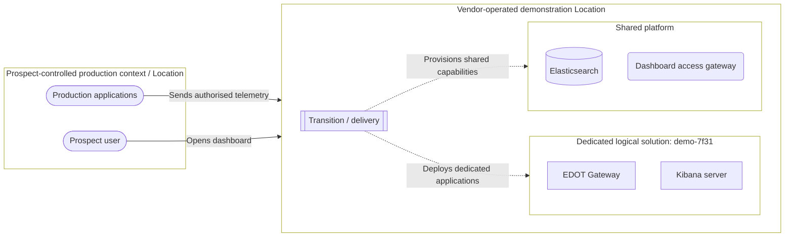
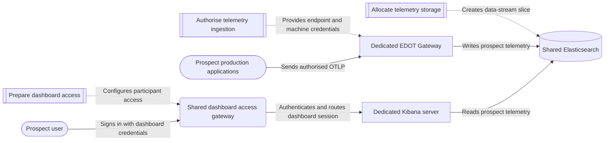

# Sales-Led Demonstration

Within the common frame from [M-02-concept-of-operations], this story follows a sales engineer carrying one temporary logical solution from a prospect's need through transition, revision and retirement.
The prospect, an online retailer, is the business beneficiary and evaluates whether the demonstration helps investigate its problem; the solution's durable identity connects that need, the sales engineer's delivery work and the resulting evidence through time.

Software engineering maintains the reusable applications, platform engineering maintains the reusable provisioning capabilities, and the qualified sales engineer combines them for each prospect-specific solution.
After adoption, routine demonstrations require no delivery work from either engineering team.
The setting is explicitly counterfactual Elastic: public descriptions of the [EDOT Collector] and its [gateway mode][EDOT modes], Kibana's [role management], and Elasticsearch [data-stream lifecycle] ground product vocabulary only, not Elastic's internal operations; the operating conditions, responsibilities and events are invented.

## A date on the calendar

An online retailer has a production payment-latency problem and a scheduled session in which to decide whether Elastic Observability can help investigate it.
The evidence must come from an authorised subset of the retailer's live OpenTelemetry data, not a prepared product tour.
The vendor therefore has to establish a prospect-specific demonstration in time for the session, keep it available for a possible follow-up, and remove it by 18 September 2026 at 18:00 UTC.

For the sales team, the objective is not a faster route to someone else's delivery queue.
It needs the agency to design, transition into operation, alter and retire a routine demonstration through an established path, without delivery-specific software or platform specialist intervention.

## Why a small demonstration is not a small change

Before adoption, demonstrations and customer-production workloads share Kubernetes infrastructure, a GitOps repository and common definitions.
An umbrella chart exposes one shared values surface.
An app-of-apps Helm template then discovers environment directories and renders child Argo CD Applications.
Those Applications combine shared cluster values, a chart revision, per-environment values and raw manifests; some of the references they follow can move.
A change in an apparently local file can therefore flow through an inherited value or application template into sibling environments.
File placement does not reveal blast radius, so developers approve every demonstration change to protect customer production from effects that do not respect directory or solution boundaries.

The following partial pseudo-tree illustrates the dependency shape; it is not a claim about an Elastic repository.

```text
delivery inputs (partial)
├── Chart.yaml
├── templates/
│   └── environment-applications.yaml # renders one Application per environment path
├── values.yaml # default template settings and chart or repository revisions
└── environments/
    ├── all-environments-values.yaml # inherited by every production customer and demo
    ├── demonstrations-values.yaml # overrides base values for every demo
    ├── shared-cluster-overlay.yaml
    ├── customer-production/
    │   ├── customer-a/
    │   │   ├── values.yaml
    │   │   └── raw-manifests/
    │   ├── customer-b/
    │   │   └── values.yaml
    │   └── …
    └── demonstrations/
        └── retailer-payment-latency/
            ├── values.yaml # all-environments -> demonstrations -> this environment
            └── raw-manifests/
```

The tree shows where inputs live, not an inheritance hierarchy.
Every production customer and demonstration inherits the all-environments defaults; every demonstration then applies the demonstration defaults before its own leaf values.
The retailer path is therefore only the last layer: the application template, root values, chart and repository revisions, cluster overlay and raw manifests also shape its outcome, and some of those inputs shape customer production too.

In this adopting organisation's GitHub workflow, anyone with direct write access can propose changes throughout the repository.
CODEOWNERS and path-aware automation can reject a change or require review, but they do not confine an author to the apparent demonstration subtree.

The backing services add a second dependency.
DevOps scripts and nominally self-service tools create accounts, roles, routes, credentials and storage allocations, but they are scattered and do not own the demonstration lifecycle.
Their versions are not clearly related to the versions of the services they manipulate, and their behaviour can drift without the discipline expected of an internal product release.
Safe use depends too often on living acquaintance with whoever last changed them.
When visible workloads disappear, no single path is accountable for releasing every slice and attachment, so operational debris remains.

Kubernetes, Argo CD and GitOps are features of this counterfactual environment, not the root problem.
The operational problem is concrete: a demonstration edit can change customer production, and no single path or team owns a demonstration from creation through cleanup.
Routine work therefore waits for people who can judge those hidden effects or approve the changes, even when the applications and backing capabilities already exist.

## Sales-led delivery for the same request

The adopting organisation establishes a distinct demonstration delivery path that accepts solution artefacts without modifying the customer-production source of intent.
Routine sales changes pass through a mediated solution-design surface where the sales engineer can change solution definitions but not arbitrary repository content.
The path compiles that intent into the GitOps-compatible files expected by the existing pipeline, rather than asking sales to edit inherited values, the application template or raw manifests that also shape customer production.
Solution intent and generated resource effects can then be reviewed separately.
Physical infrastructure and shared services may remain shared, but each effect now belongs to one logical solution with a durable identity and deadline.

For this adopting organisation, the finite provisioning processes move from scattered tools into the catalogue as versioned Go code authored by the adopting organisation alongside the interfaces and applications they serve.
Changes enter the established path through ordinary engineering review and release, so the sales engineer invokes maintained procedures rather than relying on acquaintance with their last author.
Platform engineering remains accountable for those reusable capabilities and procedures, software engineering remains accountable for the reusable applications, and neither performs routine work for each demonstration.
The sales engineer has the permissions and access needed to run the approved procedures without asking another team to perform or approve each routine step.

## The demonstration through time

The qualified opportunity records the retailer's latency problem, intended evaluation experience, scheduled session, authorised telemetry conditions and retirement deadline.
The retailer is the business beneficiary: its evaluation need justifies the demonstration and supplies the test of whether it is useful.
Acting in the solution-engineering domain, a sales engineer designs one logical solution from those needs and gives it a durable identity.

The retailer's production applications stay outside the logical solution in a prospect-controlled Location and may export only the telemetry subset the retailer authorises.
The design places a dedicated EDOT Gateway and Kibana server in an opaque, adopter-defined demonstration Location under the vendor's control, with prospect-specific access and data handling.

The sales engineer sends the resulting solution artefact through the distinct delivery path.
Provision begins with finite jobs that prepare two different kinds of access.
For the retailer participant, they create a human account, assign a Kibana role limited to this demonstration's dashboards and data, and establish the dashboard route or URL.
For the retailer's production applications, they register the ingestion endpoint and routes and issue machine credentials used to send telemetry.
The jobs also allocate the Elasticsearch data-stream slice and retention.
These completed jobs configure the shared dashboard access gateway, which authenticates the retailer participant and routes the dashboard session to the dedicated Kibana server, and provide the access and storage details used by the dedicated applications.
Every result is attributable to the solution's identity and deadline.

Deploy then starts the dedicated EDOT Gateway and Kibana server as long-running Unix processes.
They use the access and storage details produced during Provision and continue reacting to telemetry and dashboard activity until they are stopped.
They belong to this demonstration, unlike the shared dashboard access gateway and Elasticsearch capabilities made available through bounded shared-service attachments.
That distinction will later determine what retirement stops and what it releases.

Once the demonstration is operational, the retailer sends its authorised telemetry subset to the dedicated gateway and opens the dashboard through the shared dashboard access gateway to investigate the payment-latency behaviour in Kibana, while the vendor keeps the demonstration available until its deadline.
The first session reveals that a payment-service signal already present in the authorised telemetry is not yet processed or presented by the demonstration, so the prospect asks for a follow-up.

The sales engineer revises the design, sends updated artefacts through the same path and extends the deadline.
Because the revised deadline remains within the sales engineer's delegated authority, it adds no managerial approval step.
Only the Provision or Deploy work made necessary by the revision repeats; the applications may continue running.
The logical solution keeps its identity, so attribution and history remain continuous while its intent and deadline change.

The deadline eventually closes the operational thread.
Retire stops the dedicated EDOT and Kibana processes, revokes prospect access and credentials, releases routes and backing-service slices or attachments, and removes telemetry according to the applicable policy.
The durable identity and history remain, but the demonstration leaves no running applications or orphaned operational attachments.

A successful sale does not turn this temporary solution into production.
The demonstration retires on its own terms, and any production service for the retailer begins as a new logical solution with a distinct identity and lifecycle.

## The solution in one glance

This illustrative semantic sketch is not proposed syntax or field allocation; it simply gathers the solution's defining intent in one view.

```text
logical solution "retailer-payment-latency-demo" {
  durable identity: demo-7f31
  Location: opaque("vendor-defined-demo-location")
  retirement deadline: 2026-09-18T18:00:00Z

  provision {
    prepare prospect dashboard access {
      create human retailer participant account
      assign Kibana role limited to this demo's dashboards and data
      establish dashboard route / URL
    }

    allocate telemetry storage {
      allocate Elasticsearch data-stream slice
      set retention
    }

    authorise telemetry ingestion {
      register endpoint and routes for authorised telemetry
      issue machine credentials to retailer applications
    }
  }

  deploy {
    dedicated EDOT Gateway {
      inputs from provision {
        authorised telemetry ingestion
        allocated telemetry storage
      }
      continuously {
        accept OTLP/HTTP and OTLP/gRPC
        write prospect telemetry to the data-stream slice
      }
    }

    dedicated Kibana server {
      inputs from provision {
        prepared prospect dashboard access
        allocated telemetry storage
      }
      continuously {
        serve routed dashboard sessions
        read prospect telemetry from the data-stream slice
      }
    }
  }
}
```

### Operational placement

The placement view locates the prospect-controlled production context beside the vendor-operated demonstration and separates resources dedicated to the logical solution from platform capabilities shared with other work.
It shows the retailer's telemetry and dashboard activity crossing into the vendor Location, while transition work provisions the shared capabilities and deploys the dedicated applications.



Pill-shaped nodes are entities controlled by the prospect; double-edged nodes are finite transition or provisioning jobs; rectangles are dedicated long-running applications; the rounded node is the shared dashboard access gateway; and the cylinder is Elasticsearch.
Dotted arrows show finite actions that establish or change operational state, while solid arrows show prospect traffic or continuous runtime interactions.

### Provisioning and runtime connections

The detailed view separates three finite jobs that prepare dashboard access, allocate telemetry storage and authorise telemetry ingestion before continuous operation begins.
The shared dashboard access gateway authenticates the retailer participant and routes the dashboard session to Kibana, while EDOT and Kibana continuously write and read the prospect's telemetry in Elasticsearch.



## Boundaries that remain

Shared infrastructure still carries capacity, security and failure-coupling risks, while a separate delivery path brings its own operational and governance burden.
Delegated sales authority is useful only while access stays appropriately bounded and retirement remains dependable.
Together, the views distinguish prospect and adopting-organisation control boundaries, their Locations, shared versus dedicated realisation, and the connections used during the evaluation.

Exact triggering and delivery mechanics remain open, as do artefact structure, authentication and routing, Elasticsearch tenancy, purge timing within policy, and failure recovery.
The story neither selects a continuous-delivery product, controller, reconciliation model, schema, API or CLI nor establishes that another adopter should use these components.

## Business acceptance

The prospect judges whether the demonstration served its evaluation need.
The adopting organisation accepts the operating model when a qualified sales engineer can design, transition into operation, alter and retire a routine demonstration without waiting for delivery work from software engineering or platform engineering.
That acceptance does not depend on whether the prospect buys the product.

Live telemetry makes the demonstration meaningful, the extension preserves its identity as intent changes, and retirement leaves no cleanup for specialists.
Together, they establish dependable lifecycle agency for the sales team.

[M-02-concept-of-operations]: M-02-concept-of-operations.md
[EDOT Collector]: https://www.elastic.co/docs/reference/edot-collector/
[EDOT modes]: https://www.elastic.co/docs/reference/edot-collector/modes
[role management]: https://www.elastic.co/docs/deploy-manage/users-roles/cluster-or-deployment-auth/kibana-role-management
[data-stream lifecycle]: https://www.elastic.co/docs/manage-data/lifecycle/data-stream/
