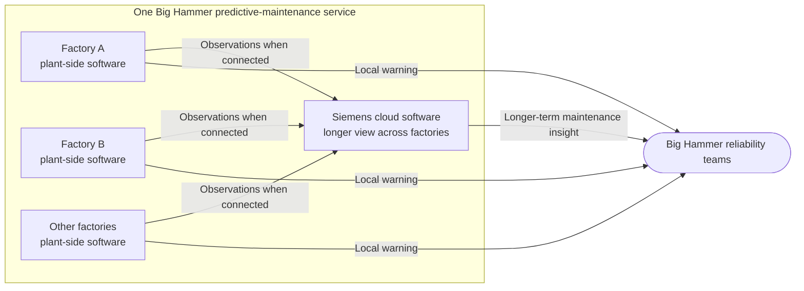

# Distributed Industrial Operation

This story applies the [Concept of Operations][M-02-concept-of-operations] to an invented Siemens customer service.
Siemens publicly offers [cloud-based predictive-maintenance software across assets and sites][Siemens-Senseye].
It also describes [hybrid edge-cloud arrangements for intelligent maintenance][Siemens-Industrial-Edge] and documents the [ingestion of industrial machine data][Siemens-machine-data].
Big Hammer Steelworks, the customer relationship, the toolkit adoption, the responsibilities and every event below are invented.

## Predictive maintenance across factories

Big Hammer operates several factories where an unexpected equipment stoppage can halt production.
Siemens provides one customer-specific predictive-maintenance service that helps Big Hammer notice deterioration early enough to plan maintenance instead.

Plant-side software observes local conditions and remains useful when cloud connectivity is intermittent.
The cloud software retains the longer view across Big Hammer's factories, giving Siemens data scientists and Big Hammer's reliability teams broader evidence for maintenance decisions.
Neither part provides the complete service alone.



Big Hammer experiences this arrangement as one service.
For the toolkit, it is one logical solution whose identity continues as its software changes.
The factories and cloud are cooperating parts of that service, not separate customer solutions.

## Existing Siemens delivery process

Siemens already operates the service successfully.
Its engineers use mature internal tooling, maintain playbooks, augment scripts for particular customer sites and personally bridge the steps that the tooling does not carry.
When a factory window opens, the right Siemens staff must be available with current instructions and knowledge of that site.

Siemens can scale this process by assigning more engineers to customer delivery.
Every factory adds another playbook and site-specific script to keep current, and each upgrade window depends on someone who knows how those pieces fit.
The service works, but its routine growth consumes skilled engineering capacity.

The Siemens group responsible for Big Hammer's service chooses the toolkit as a different delivery foundation.
It wants supported software to carry more of the repeatable upgrade knowledge while people retain authority, operational judgement and the ability to intervene.
The group is not trying to rescue a failed service or discover predictive maintenance for the first time.
Its first obligation is to preserve the value Big Hammer already receives.

## Preparing solution revision R2

As operating data accumulates, Siemens data scientists see a way to improve the product's detection behaviour.
The change updates cloud software and data models together with related plant-side software.
It is an ordinary product change, but its parts cannot become operational everywhere at once.

Siemens identifies the intended edition as **solution revision R2**.
R2 belongs to the same logical solution as the previously accepted R1 revision.
It expresses the intended cloud-and-plant arrangement after the change without claiming that every factory already runs it.

Siemens verifies the new software and prepares a supported way to introduce it at the factories.
The software carries the repeatable upgrade know-how, so the employee executing the change does not have to interpret an arbitrary playbook or reproduce technical knowledge from memory.
People still authorise and initiate the work, transport approved data where the environment requires it, and judge the result.
They intervene when the supported path cannot complete.

> **Deliberately unresolved.**
> R1 and R2 are story labels, not a selected identifier scheme.
> The story does not decide how revisions are encoded, how data is transported, how Siemens implements reconciliation, or how artefacts and product interfaces are structured.

## Deploying R2 across cloud and factories

Siemens can introduce the cloud change centrally, but Big Hammer's factories have different production commitments.
Each factory manager chooses a window in which Siemens may change the plant-side software and retains the decision to return the factory to production.

The cloud therefore begins running the software specified by R2 while the factories still run software specified by R1.
At the first factory, a Siemens service engineer joins the agreed window and uses the supported upgrade capability to introduce the plant-side release.
Siemens confirms that its software is running as intended.
The factory manager decides that production may resume.
Big Hammer's reliability team confirms that the service is ready for local use.
None of those decisions substitutes for another.

As the factory resumes operation, its uploads carry the logical solution's identity, R2 and the application version that produced the data.
If connectivity is interrupted, the plant-side software continues its local work and retains that context until the data can reach the cloud.
The cloud application can then handle information according to the applicable revision, while Siemens operations can see which factories have moved and which are intentionally waiting.

The independent factory windows produce a staggered state:

```text
                            Cloud       Factory A       Factory B       Factory C
Start                         R1            R1              R1              R1
Cloud release                 R2            R1              R1              R1
Factory A accepts R2          R2            R2              R1              R1
Factory B window closes       R2            R2          R1 retained         R1
Factory C accepts R2          R2            R2          R1 retained         R2
Factory B new window          R2            R2              R2              R2
```

For a time, R1 and R2 are both intentionally present within the same customer service.
Siemens operations decide which factory needs follow-up and when; the toolkit does not make that decision or force the factories to converge.

## When factory B remains on R1

At Factory B, the upgrade cannot complete before the authorised window closes.
Production cannot remain paused while Siemens investigates without a new agreement from Big Hammer.

Siemens and Big Hammer return the factory to its previously accepted R1 software and resume production.
Data uploaded from that factory remains identifiable with R1 and the application version that produced it, while the software running elsewhere remains untouched.
The cloud can continue handling that factory's data without pretending that Factory B has moved to R2.

Siemens schedules another attempt for a later window.
Its engineers may intervene directly if the supported path again needs help.
Keeping that action available matters: codifying the routine work does not turn an authorised engineering decision into a prohibited exception.

## Completing the R2 rollout

R2 is accepted at Factory C during its own scheduled window while Factory B continues on R1.
Siemens then returns to Factory B in a later window, completes the plant-side upgrade and accepts the software running there.
Factory B's manager separately returns the factory to production, and Big Hammer's reliability team accepts the service for local use.
Once the intended cloud and factory changes have been accepted, the Siemens service owner declares R2 available across Big Hammer's intended footprint.

Big Hammer's reliability teams continue to receive the alerts and maintenance insight on which production already depended.
That business parity is the required result.
The predictive-maintenance service has not become valuable because of the toolkit; it has remained valuable while Siemens changed how the service moves through its cloud and factory estate.

Siemens can now relate the intended R2 change to the software running in the cloud and at each factory.
It can connect returning factory data to that revision and application version, and see who authorised and accepted each step.
The nominal upgrade knowledge is carried by supported software rather than only by current playbooks, augmented scripts and the people who remember how to join them.

If that path earns enough confidence, Siemens may later let Big Hammer's IT or OT staff perform some routine upgrades with Siemens ready for escalation during the agreed window.
That is a possible gain, not the test this story needs to pass.

The operational change is already concrete: one Siemens team has carried one evolving customer service through different tools, authorities and schedules without losing sight of what Big Hammer was meant to receive or what was actually running.

[M-02-concept-of-operations]: M-02-concept-of-operations.md
[Siemens-Industrial-Edge]: https://www.siemens.com/en-gb/products/industrial-edge/
[Siemens-Senseye]: https://www.siemens.com/en-us/products/industrial-digitalization-services/senseye-cloud-application/
[Siemens-machine-data]: https://developer.siemens.com/senseye/machine/index.html
