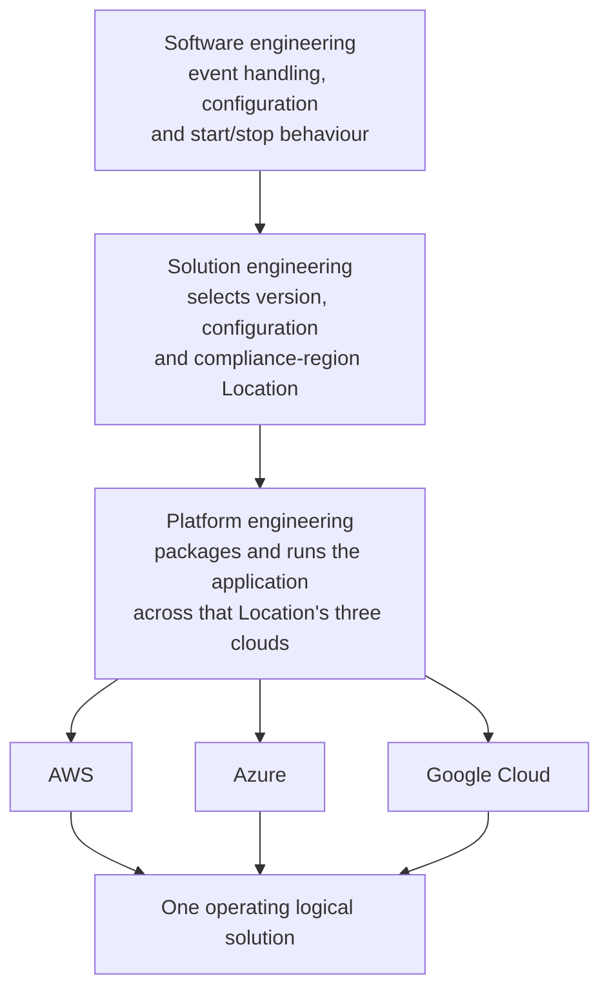

# One Responsibility Model Across Platforms

Within the common frame from [M-02-concept-of-operations], this story shows how the toolkit's responsibility model applies to an established event-intake solution running in serverless environments across three clouds.
A routine event-rule change follows the work from software engineering through solution engineering to deployment and operation.
The adopting company is the business beneficiary because its product depends on receiving customer events consistently.

The setting is explicitly counterfactual Twilio Segment.
Public descriptions of Segment's [Track specification] and [HTTP Tracking API] establish event intake as a recognisable product concern, but not the operating model below.
The adopting organisation, toolkit adoption, internal practices, multi-cloud arrangement, responsibilities and every event in the story are invented.

## An established three-provider service

A developer-focused B2B software company operates its multi-tenant event-intake service through serverless container environments in AWS, Azure and Google Cloud.
Customer commitments and the need to receive data near customers' chosen environments make all three providers an accepted part of the business.

The service is already useful and professionally sustained.
Each provider edge passes inbound requests to the application, while an established provider-specific path supplies configuration, starts and monitors the application, and releases new versions.
Those paths follow different packaging rules, commands and rollout controls because the platforms are different.
The company already knows how to operate them.

The company brings this service under the toolkit's responsibility model.
Software engineering defines and verifies how the application handles events, what its configuration means, and how it starts and responds to a request to stop.
Solution engineering chooses the application version and configuration that express the intended event-intake solution.
Platform engineering maintains the code and tools that package, configure and run the application in each cloud.
These are responsibilities people take on, and the same person may perform work in more than one of them.

The significance of that allocation becomes visible during a routine change.

## One application change

A software engineer adds a supported validation option for `checkout.completed` events.
When the option is selected, the application requires an order reference before accepting the event.
This is one application decision: valid events should be accepted and malformed events rejected according to the same rule whichever provider receives them.

The engineer implements the option in the reusable event-intake application and exercises it through a common local harness.
The engineer uses the same local harness to start and configure the application and check its event handling, without running AWS, Azure or Google Cloud development tools.
One event includes the required order reference and is accepted; another omits it and is rejected.

Software engineering can therefore verify the application rule independently of the code and configuration that platform engineering maintains to run the service in each cloud.
Both the local harness and the cloud integrations use the application's supported ways of starting, receiving configuration and receiving a cancellation signal.
Platform engineering adapts each cloud's mechanisms to those application expectations.
The local checks establish how the application behaves; deployment checks will establish whether it behaves that way when running in each cloud.

## One decision, three realisations

After software review, the person doing the solution engineering selects the new application version with the validation option enabled.
The resulting solution revision describes one intended logical solution rather than three provider-specific variants.
During release review, the people responsible for the release examine the selected version and configuration together and sign off on rejecting events without an order reference as the intended service modification.

For this operation, the company identifies where the solution belongs by a compliance region with established data-handling rules.
That region is one `Location` in its solution description, and the region's existing deployments span AWS, Azure and Google Cloud.
The person selecting the event rule names that Location without having to specify the clouds underneath it.
This uses the [corpus meaning of Location][Location definition]: the adopting organisation defines the place where the solution is available.
Platform engineering maintains the mapping from that region to the cloud deployments, and the company remains responsible for operating them according to the region's rules.

The company's engineers who maintain the running service in each cloud then deploy the reviewed revision through their established AWS, Azure and Google Cloud delivery paths.
Each path may use a different artefact, configuration mechanism, command, health check and rollout strategy.
Those engineers decide when to proceed, stop or roll back a rollout in each environment and check the deployment before accepting it into service.
The paths may also finish at different times, leaving an observable period in which parts of the same logical solution realise different revisions.

The same solution choice reaches all three clouds through the company's delivery paths:

The arrows follow the work from application development to solution selection and deployment.
They do not prescribe teams, executables or file formats.

## The revision reaches operation

Once the new version receives traffic, the engineers maintaining the service check which version handled the events and whether the selected validation option is enabled.
They compare the event responses in each cloud with the cases checked locally: an otherwise valid event with an order reference is accepted, and one without it is rejected.
That comparison tells them whether the application version and configuration selected during solution engineering produce the expected event responses after deployment.

During a rollout, the cloud platform stops old containers as it replaces them.
The integration code passes the platform's stop request to the application as a cancellation signal.
If the application supports graceful shutdown and has opted into that behaviour, it can use the time available to finish or stop work before exiting.
Platform engineering handles how the stop request reaches the application; software engineering handles how the application responds.
The cloud platform determines how much time it allows before forcing the container to stop.

As each rollout completes, the engineers responsible for that environment check the running application version, its event responses and the deployment health before accepting the deployment into service.
The person doing the solution engineering uses those results to confirm that the selected event rule is in effect throughout the compliance region.
Acting for the company, that person accepts the result when the running service meets the intended change across the region.

## Appendix: Running the application as a serverless function

In the story above, the application runs as a server that handles incoming requests until it is stopped.
A serverless function receives work differently: the provider invokes function code with an event and expects a result from that invocation.
Putting the code in a container image does not remove this difference.
For example, a container used by AWS Lambda must include code that communicates with Lambda through its Runtime API; AWS supplies runtime interface clients for this purpose, as described in [AWS Lambda container-image requirements].

Running the toolkit application this way would need extra integration code.
That code would take the event supplied by the provider, pass it to the application and return the application's result or error in the form the provider expects.
It would also need to account for the invocation's time limit, pass cancellation to the application when needed, and handle any shutdown behaviour the application has chosen to support.
These are changes to how work reaches and leaves the application, so changing its packaging alone would not be enough.

How to write and package that integration code remains open, including whether any of it could be shared across the three providers.
Engineers should still be able to exercise the application locally without cloud development tools.
They would check the integration code separately to establish that it passes events, results, errors and cancellation correctly between the provider and the application.

## Preserved boundaries

The example leaves these concerns outside its scope:

- What happens to events after intake, including identity resolution, analytics and routing data to other services.
- The final Go interfaces, command-line design, and arrangement of packages and executables, including whether integration code is written by hand, generated or packaged separately.
- How solution artefacts are divided among files, how many there are, and the structure of the Solution Exchange Format (SEF).
- The deployment configuration, traffic-routing policy and final arrangement of the toolkit's components.
- Matching infrastructure, latency, scaling, availability or failure behaviour across clouds; the comparison here concerns the application's event rule.

## The same responsibilities on different platforms

The event rule is now in effect throughout the compliance region.
The application engineer developed and checked it through one local harness, solution engineering selected it for the region, and the engineers maintaining the deployments put it into service in all three clouds.
Each cloud required different packaging and operating work, which fitted within platform engineering's existing responsibility.

That division also allowed the solution description to use the company's business language: the person choosing the event rule could name the compliance region while platform engineering handled its deployments.
The toolkit's responsibility model accommodated the whole release, from the application decision to the different ways of running it.
The company carried the change through its established operation without needing a separate responsibility model for each cloud.

[AWS Lambda container-image requirements]: https://docs.aws.amazon.com/lambda/latest/dg/images-create.html
[HTTP Tracking API]: https://www.twilio.com/docs/segment/connections/sources/catalog/libraries/server/http-api
[Location definition]: ../vocabulary.md
[M-02-concept-of-operations]: M-02-concept-of-operations.md
[Track specification]: https://www.twilio.com/docs/segment/connections/spec/track
